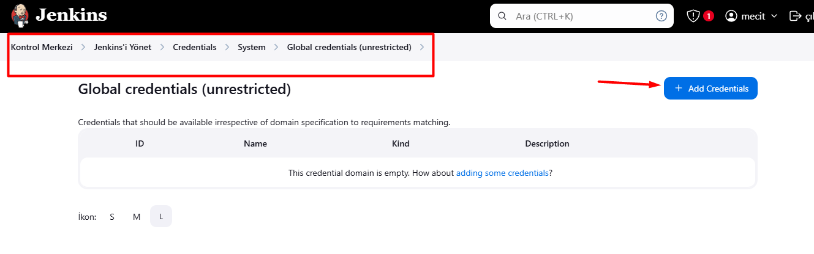

# jenkins server için gerekli yüklemeler:

## jenkins kurulumu:

Scripts/install_jenkins.sh

openjdk-17-jdk yüklü değilse onuda yükleyecek şekilde yapılandırıldı


## nodejs ve cypress kurulumu:

Scripts/install_node_cypress.sh


## terraform kurulumu:

Scripts/install_terraform.sh


## docker kurulumu:
Scripts/install_docker.sh

Burada jenkins'ide docker grubuna ekliyorum. Daha sonra kullanmak için


## trivy kurulumu:
Güvenlik testleri için.

Scripts/install_trivy.sh


## kubectl kurulumu:

kubernetes ile terminalde işlem yapabilmek için.

Scripts/install_kubectl.sh


## grafana kurulumu:

metrikleri görselleştirmek için


## prometheus kurulumu:
metrikleri alabilmek için

Scripts/install_prometheus.sh


Jenkinse "Prometheus metrics" eklentisini ekleyip yeniden başlatıyoruz.
````sh
sudo systemctl restart jenkins
````

jenkins'in metriklerini toplayabilmesi için */etc/prometheus/prometheus.yml* dosyasına aşağıdaki kodu ekliyoruz.

````sh
sudo nano /etc/prometheus/prometheus.yml
````

````sh 
- job_name: jenkins
  metrics_path: "/prometheus"
  static_configs:
    - targets: ["localhost:8080"]
````


## node_expporter kurulumu:

prometheus için metrik toplaması için kuruyoruz


jenkins server'ın metriklerini alabilmesi için prometheus.yaml dosyasına node_exporter url'ini ekliyoruz:

````sh
sudo nano /etc/prometheus/prometheus.yml
````
````sh
- job_name: node_export_jenkins
  static_configs:
    - targets: ["localhost:9100"]
````


````sh
sudo  systemctl restart prometheus
````


# Jenkins konfigürasyonu:

http://localhost:8080/ adresinden jenkins konsola bağlanıyoruz

ilk parolayı almak için terminalde şu kodu giriyoruz:

````sh
sudo cat /var/lib/jenkins/secrets/initialAdminPassword
````


aldığımız parolayı buraya yapıştırıp devam ediyoruz.


önerilen eklentileri yükleyi seçiyoruz.


kendi şifremizi belirliyoruz


## Jenkins uygulamasındaki ayarlamalar:

### Pipeline'ı Çalıştırmak İçin Gerekli Plugin'ler

Jenkins üzerinde gerekli plugin'lerin kurulu olması gerekir.

Kurulum: Manage Jenkins > Manage Plugins > Available bölümüne 
      "Docker" 
      "AWS Credentials"
      "Terraform"
      "Prometheus metrics"

yazın ve yükleyin.


### pipeline post dımındaki email göderimi için jenkins ayarlamaları:

İzlenecek yol: *Jenkinsi yönet > Sistem > E-posta Bilgilendirmesi*

bu alana aşağıdaki gibi doldurmalıyız:

   SMTP server

    "smtp.gmail.com"

   Use SMTP Authentication?

    Username

    "mecit.tuksoy@gmail.com"

    Password

    "enter the password we saved"

    Check the "Use SSL" box

    SMTP Port?

     "465"

Gmail hesabımızdan uygulama şifresi alma:


test ederek mailin geldiğini gördük


jenkinse email bilgilerimizi "global credentials" olarak  girmemiz gerekiyor.




*Kontrol Merkezi > Jenkins'i Yönet > Sistem > Extended E-mail Notification* bilgileri burayada girmemiz gerekiyor


### jenkins server'da aws hesabımıza erişebilmek için jenkins kullanıcısına geçip "aws configure" yapıyoruz:

````sh
sudo su - jenkins
aws configure
  AWS Access Key ID [None]:
  AWS Secret Access Key [None]:
  Default region name [None]:
  Default output format [None]:
````


### jenkins'in dockerhub'a image push edebilmesi için jenkins'e "docker credentials" bilgilerini girmeliyiz:


### jenkins pipeline'ı ayarlıyoruz:

1- Jenkins ana sayfasında "Yeni Öğe"'ye tıklayın.

2- Öğe adını girin.

3- "Pipeline" seçin.

4- "Build Triggers" tetikleyici oluşturma kısmından "GitHub hook trigger for GITScm polling" tik atın.

5- "Pipeline" altında "Definition" kısmında "SCM" yi "Git" seçin

6- "Repository URL" kısmına github repo url girin.

7- "Branch Specifier (blank for 'any')" kısmına hangi branch'da çalışmasını istiyorsanız yazabilirsiniz.

8- "Script Path" Jenkinsfile ismi farklı ise onu burada belirtmelisiniz.

9- "Kaydet" diyebiliriz.


